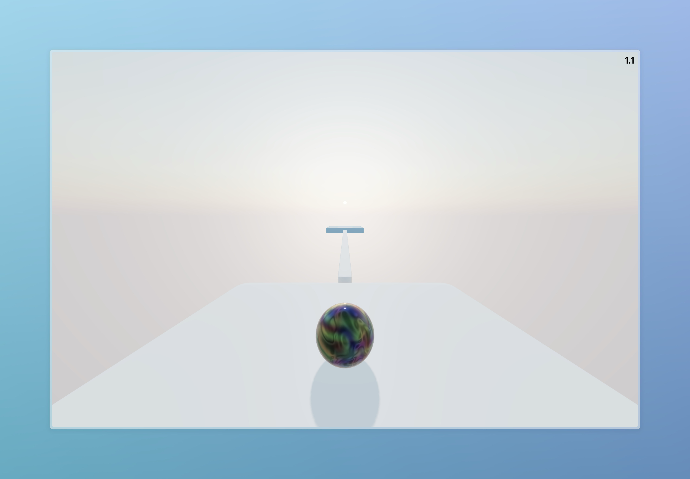

# the ball game

## Description

Work in progress.

This is a simple ball game written in Typescript using Threlte.

Try it out [here](https://flo-bit.github.io/ball-game/).

## Todo

- [x] Countdown
- [x] Improve menu
- [x] Add time keeping and local highscores
- [x] show "new highscore" when you get a new highscore

- [ ] capture mouse in game
- [ ] Add more levels
- [ ] Add sharing levels (import/export) maybe using links?
- [ ] Add different balls
- [ ] Add different platforms / forces
- [ ] Add mobile controls: joystick or tilt
- [ ] Add gamepad support
- [ ] Add sound effects + music (+ toggle on/off in settings)
- [ ] REFACTOR (later :P)